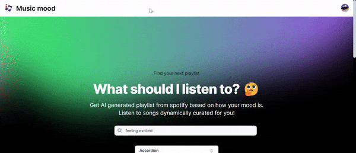

# AI Mood Music Generator 🎵

AI Mood Music Generator is a web application that analyzes text input to detect the mood and generates a Spotify playlist based on the mood and selected genres. It is built using:

- Next.js
- LangChain
- Google-GenAI
- Spotify Web API
- TypeScript
- ShadCN UI
- Lucide Icons

## 👾 Features

- Analyze text to detect mood using AI.
- Select multiple music genres using checkboxes.
- Generate a Spotify playlist based on the detected mood and selected genres.
- Display playlist with embedded Spotify player for direct playback.
- Responsive and user-friendly interface.

## 📒 Process

I started by integrating LangChain to analyze the mood of the provided text input. Next, I used the Spotify Web API to fetch playlists that match the detected mood and selected genres. I then implemented a multi-select genre feature using ShadCN UI's `Checkbox` component. The playlist results are displayed with an embedded Spotify player for users to play songs directly from the app.

Afterward, I focused on styling the application using Shadcn UI, ensuring a modern and responsive design. Lastly, I performed some small refactoring and styling touch-ups to enhance the user experience.

## 🚦 Running the Project

To run the project in your local environment, follow these steps:

1. Clone the repository to your local machine.
2. Run `npm install` or `yarn` in the project directory to install the required dependencies.
3. Create a `.env.local` file in the root of the project and add your Spotify API credentials and Google API key:
    ```
    NEXT_PUBLIC_SPOTIFY_CLIENT_ID=your_spotify_client_id
    NEXT_PUBLIC_SPOTIFY_CLIENT_SECRET=your_spotify_client_secret
    NEXT_PUBLIC_GOOGLE_API_KEY=your_google_api_key
    ```
4. Run `npm run dev` or `yarn dev` to start the project.
5. Open [http://localhost:3000](http://localhost:3000) in your web browser to view the app.

## 📝 Example Code Snippets

### LangChain Integration

```typescript
import { ChatGoogleGenerativeAI } from "@langchain/google-genai";

const model = new ChatGoogleGenerativeAI({
  apiKey: process.env.NEXT_PUBLIC_GOOGLE_API_KEY,
  temperature: 0.7,
  model: "gemini-1.5-flash",
  maxOutputTokens: 8192,
  topK: 64,
  topP: 0.95,
  safetySettings: [
    {
      category: "HARM_CATEGORY_HARASSMENT",
      threshold: "BLOCK_LOW_AND_ABOVE",
    },
  ],
});

export const analyzeMood = async (text: string): Promise<string> => {
  const prompt = `Analyze the mood of the following text and respond with a single word: ${text}`;
  try {
    const res = await model.invoke(prompt);
    return res.content.trim().toLowerCase();
  } catch (error) {
    console.error("Error analyzing mood:", error);
    throw error;
  }
};
```

## 📹 Demo

  

